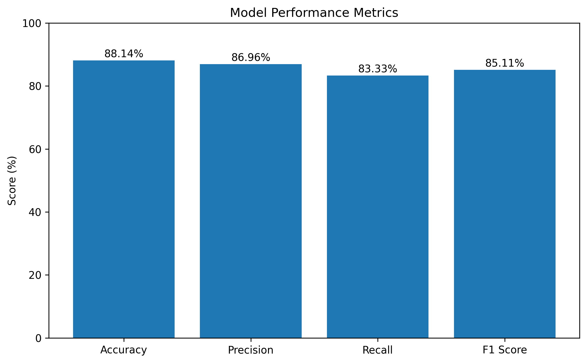
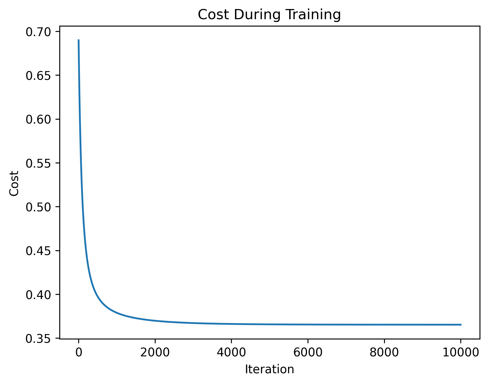
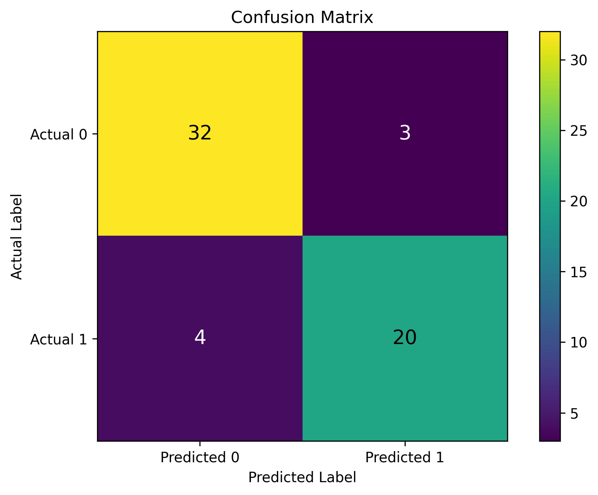

# Heart Disease Classifier from Scratch

This project implements a simple heart disease classifier using logistic regression built from scratch with NumPy.

The goal of this project is to understand the full machine learning workflow for binary classification, including data preprocessing, train/test splitting, feature normalization, model training, and evaluation.

This project is educational and is not intended to be used as a medical diagnostic tool.

## Project Overview

The model predicts whether heart disease presence exists based on patient health features such as age, cholesterol, resting blood pressure, maximum heart rate, and other clinical measurements.

The original target column contains values from 0 to 4. For this project, the task was simplified into binary classification:

* `0`: no heart disease presence
* `1`: heart disease presence

## Dataset

The project uses the UCI Heart Disease dataset.

The dataset contains patient health-related features and a target column indicating heart disease presence.

After removing rows with missing values, the final dataset used in this project contained:

* 297 examples
* 13 input features
* 1 binary target label

## Methods Used

The project was implemented using:

* Python
* NumPy
* Pandas
* Matplotlib
* UCI ML Repository package

The logistic regression model was implemented from scratch, including:

* sigmoid function
* logistic regression cost function
* gradient calculation
* gradient descent
* prediction function
* accuracy
* precision
* recall
* F1 score
* confusion matrix

No machine learning library was used for the main model implementation.

## Model Workflow

The notebook follows this workflow:

1. Load the dataset
2. Inspect the data
3. Convert the target into binary labels
4. Handle missing values
5. Separate features and labels
6. Convert data into NumPy arrays
7. Split the data into training and testing sets
8. Normalize the features
9. Implement logistic regression from scratch
10. Train the model using gradient descent
11. Evaluate the model using classification metrics

## Results

The model achieved the following results on the test set:

| Metric    |  Score |
| --------- | -----: |
| Accuracy  | 88.14% |
| Precision | 86.96% |
| Recall    | 83.33% |
| F1 Score  | 85.11% |

The confusion matrix values were:

| Value           | Count |
| --------------- | ----: |
| True Negatives  |    32 |
| False Positives |     3 |
| False Negatives |     4 |
| True Positives  |    20 |

## Visualizations

### Metrics Summary



### Cost During Training



### Confusion Matrix



## Interpretation

The model performed well for a simple logistic regression model built from scratch.

The accuracy shows that the model correctly classified most test examples. The precision score shows that most positive predictions were correct, while the recall score shows that the model identified most actual positive cases.

Since this is a small educational project using a public dataset, the results should be interpreted as a learning exercise rather than as a real-world medical system.

## Limitations

This project has several limitations:

* the dataset is small
* missing values were dropped instead of imputed
* only logistic regression was used
* no regularization was added
* no hyperparameter tuning was performed
* no comparison with scikit-learn was included in this version
* the model is not suitable for real medical diagnosis

## What I Learned

Through this project, I practiced:

* preparing a real-world dataset for classification
* implementing logistic regression from scratch
* using gradient descent for model training
* evaluating classification models beyond accuracy
* understanding precision, recall, F1 score, and confusion matrix values
* documenting a machine learning project clearly for GitHub

## How to Run

Install the required libraries:

```bash
pip install -r requirements.txt
```

Then open the notebook:

```text
notebooks/heart-disease-classifier.ipynb
```

Run the notebook cells from top to bottom.
